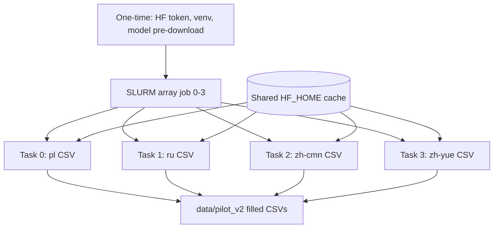

# TranslateGemma 27B on HPC (SLURM) for pilot_v2

## Goal

Fill the empty translation columns in [`data/pilot_v2/`](data/pilot_v2/) using `google/translategemma-27b-it`, running on your cluster GPUs instead of SageMaker.

**Workload:** 4 CSVs × 180 rows × 3 fields ≈ **2,160 translations** total, split as **540 translations per parallel job**.

---

## Data (unchanged from SageMaker plan)

| CSV file | Target lang code |
|----------|------------------|
| `refusalbench_translation_pl_samples.csv` | `pl` |
| `refusalbench_translation_ru_samples.csv` | `ru` |
| `refusalbench_translation_zh-cmn_samples.csv` | `zh` (Simplified) |
| `refusalbench_translation_zh-yue_samples.csv` | `zh-HK` (Cantonese workaround; no official `yue` code) |

Per row, populate:
- `perturbed_query_TRANSLATED`
- `perturbed_context_TRANSLATED`
- `original_answers_TRANSLATED` (parse `original_answers_EN` with `ast.literal_eval`, translate each answer, write back as a Python-list string)

Max sample context ~1.7K chars — within TranslateGemma’s 2K-token limit.

---

## Architecture



Each array task:
1. Loads the 27B model once on **1 GPU**
2. Reads one CSV from `data/pilot_v2/`
3. Writes to a task-specific output path (or in-place with checkpoint safety)
4. Saves checkpoint after each row

No file conflicts: each task owns a different CSV.

---

## GPU selection

| GPU | VRAM | 27B bf16 (~58GB weights) | Use |
|-----|------|--------------------------|-----|
| **H100 80GB** | 80GB | Fits comfortably | **Preferred** — fastest |
| **H100-NVL** | 94GB | Most headroom | Use if H100 queue is long |
| **A100 80GB** | 80GB | Fits comfortably | Good fallback |

Request **1 GPU per array task** (`--gres=gpu:1`). No multi-GPU needed.

**Time estimate per task:** model load ~5–15 min + ~540 generations ≈ **30–60 min** on H100; request **2–3 hr walltime** per task for safety.

---

## Prerequisites (one-time on HPC)

### Hugging Face
- Accept **Gemma license** on [google/translategemma-27b-it](https://huggingface.co/google/translategemma-27b-it)
- Set token in job env (never commit): `export HF_TOKEN=...`

### Shared model cache (~58GB)
```bash
export HF_HOME=/scratch/$USER/hf_cache   # or cluster-wide shared path
```
Run a one-time pre-download before the array job to avoid 4 concurrent downloads:
```bash
huggingface-cli download google/translategemma-27b-it --token $HF_TOKEN
```

### Python environment
Create a venv on shared filesystem:
```bash
module load cuda/12.x python/3.11   # adjust to your cluster
python -m venv /scratch/$USER/venvs/translategemma
source /scratch/$USER/venvs/translategemma/bin/activate
pip install torch transformers>=4.49.0 accelerate sentencepiece safetensors pandas tqdm
```
Match the PyTorch wheel to the cluster CUDA version.

---

## Code to add

Reuse the same translation **core** the SageMaker plan described, but split into a shared module + HPC runner (no AWS/S3).

### 1. Shared core — [`scripts/translation/translate_core.py`](scripts/translation/translate_core.py)

Single source of truth for:
- `LANGUAGE_CONFIG`: filename → target lang code
- `load_model(model_id, device)` — `AutoModelForImageTextToText` + `AutoProcessor`, bf16, `device_map={"": device}`
- `translate_text(model, processor, text, target_code, source_code="en")` — official chat template:

```python
messages = [{
    "role": "user",
    "content": [{
        "type": "text",
        "source_lang_code": "en",
        "target_lang_code": target_code,
        "text": text,
    }],
}]
```

- `translate_answers(model, processor, answers_en, target_code)` — translate list items individually
- `process_csv(csv_path, output_path, checkpoint_path, max_samples=None)` — row loop with checkpoint/resume
- Set `translator_notes` to `provider=translategemma-27b-it; target=<code>`

### 2. HPC entrypoint — [`scripts/translation/translate_hpc.py`](scripts/translation/translate_hpc.py)

CLI for SLURM array tasks:
```
--task-id 0|1|2|3          # maps to CSV via LANGUAGE_CONFIG
--input-dir data/pilot_v2
--output-dir data/pilot_v2/translated   # or in-place with .bak
--checkpoint-dir data/pilot_v2/.checkpoints
--max-samples N            # smoke test
--model-id google/translategemma-27b-it
```

`task-id` selects exactly one CSV; array task 0 → pl, 1 → ru, 2 → zh-cmn, 3 → zh-yue.

### 3. SLURM array script — [`scripts/translation/slurm/translate_array.sh`](scripts/translation/slurm/translate_array.sh)

```bash
#!/bin/bash
#SBATCH --job-name=translategemma
#SBATCH --array=0-3
#SBATCH --gres=gpu:h100:1
#SBATCH --cpus-per-task=8
#SBATCH --mem=64G
#SBATCH --time=03:00:00
#SBATCH --output=logs/translate_%A_%a.out

module load cuda/12.x python/3.11
source /scratch/$USER/venvs/translategemma/bin/activate
export HF_TOKEN=...
export HF_HOME=/scratch/$USER/hf_cache

cd $SLURM_SUBMIT_DIR
python scripts/translation/translate_hpc.py \
  --task-id $SLURM_ARRAY_TASK_ID \
  --input-dir data/pilot_v2 \
  --output-dir data/pilot_v2/translated \
  --checkpoint-dir data/pilot_v2/.checkpoints
```

Adjust `#SBATCH --gres=gpu:h100:1` to `gpu:a100:1` or partition-specific syntax as needed.

### 4. Smoke-test script — [`scripts/translation/slurm/translate_smoke.sh`](scripts/translation/slurm/translate_smoke.sh)

Single-GPU job, `--max-samples 3`, `--task-id 0` (pl only) before launching the full array.

### 5. Merge helper — [`scripts/translation/merge_translated.py`](scripts/translation/merge_translated.py)

After all 4 tasks succeed, copy `data/pilot_v2/translated/*.csv` → `data/pilot_v2/` (or verify and replace). Optional: diff row counts vs source.

### 6. Dependencies — [`scripts/translation/requirements-hpc.txt`](scripts/translation/requirements-hpc.txt)

```
torch>=2.4.0
transformers>=4.49.0
accelerate>=0.34.0
sentencepiece
safetensors
pandas
tqdm
```

### 7. Notebook — [`notebooks/translate.py`](notebooks/translate.py)

Document HPC workflow: env setup, smoke test command, `sbatch translate_array.sh`, merge step. No SageMaker content unless you keep both paths side by side.

---

## Execution steps

1. **Accept Gemma license** + create HF token.
2. **Create venv** and install [`requirements-hpc.txt`](scripts/translation/requirements-hpc.txt).
3. **Pre-download model** to shared `HF_HOME` (one interactive or short setup job).
4. **Sync repo + data** to HPC (git clone or rsync `data/pilot_v2/`).
5. **Smoke test:** `sbatch translate_smoke.sh` — verify 3 pl rows, answer-list formatting, checkpoint resume.
6. **Full run:** `sbatch translate_array.sh` — 4 parallel jobs.
7. **Monitor:** `squeue -u $USER`, tail `logs/translate_*`.
8. **Merge outputs** into `data/pilot_v2/` via `merge_translated.py`.
9. **Spot-check** a few rows per language (especially `zh-yue` / `zh-HK`).
10. **(Optional)** Convert filled CSVs to JSONL matching [`data/pilot/pilot_multilingual.jsonl`](data/pilot/pilot_multilingual.jsonl) for evaluation with [`run_models_all.py`](refusalbench/naturalquestions/run_models_all.py).

---

## Checkpointing and preemption

Each array task writes its own checkpoint file, e.g.:
- `data/pilot_v2/.checkpoints/pl.json` — `{row_idx: {field: translated_text, ...}}`

On restart, skip rows already in checkpoint. Re-submit failed array tasks individually:
```bash
sbatch --array=2 translate_array.sh   # retry zh-cmn only
```

Write output CSV atomically: write to `*.csv.tmp` then rename on completion.

---

## Parallelism notes (4 jobs × 1 GPU)

| Benefit | Caveat |
|---------|--------|
| ~4× faster wall-clock vs single sequential job | 4 GPUs reserved simultaneously — ensure allocation allows |
| No cross-task file conflicts | Pre-download model once to avoid cache lock contention |
| Independent retry per language | Slightly higher total cluster GPU-hours than 1 long job |

If the queue rejects 4 concurrent H100s, fall back to `--array=0-3%1` (one at a time) or run overnight.

---

## Risks and mitigations

| Risk | Mitigation |
|------|------------|
| Cantonese via `zh-HK` | Manual review; document in `translator_notes` |
| SLURM preemption / time limit | Per-CSV checkpoints; re-submit individual array IDs |
| Concurrent HF downloads | Pre-download step before array launch |
| CUDA / PyTorch mismatch | Pin versions after successful smoke test; document in SLURM script |
| `original_answers_EN` parse errors | `ast.literal_eval` with per-row error log, skip or flag row |
| 4 jobs × 58GB RAM for model | 64G `--mem` is enough; model lives on GPU |

---

## What you do NOT need (HPC path)

- AWS account, S3, IAM, SageMaker SDK
- SageMaker JumpStart / Optimum Neuron
- Real-time endpoint or `HuggingFaceModel.deploy()`
- Multi-GPU setup (single 80GB GPU is sufficient for 27B)

---

## Relation to SageMaker plan

The SageMaker plan at [`.cursor/plans/translategemma_sagemaker_processing_d8ea6c53.plan.md`](.cursor/plans/translategemma_sagemaker_processing_d8ea6c53.plan.md) remains valid as a cloud fallback. Both paths should share [`translate_core.py`](scripts/translation/translate_core.py); only the launcher differs (`translate_hpc.py` + SLURM vs `submit_processing_job.py`).
