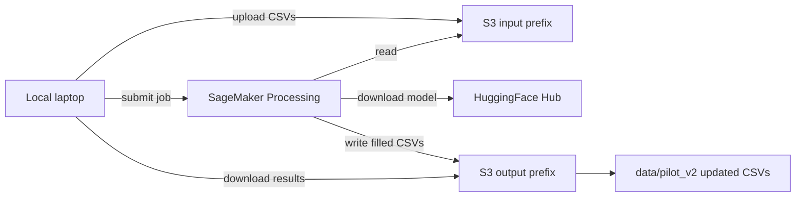

# TranslateGemma 27B on SageMaker Processing for pilot_v2

## What those Hugging Face / AWS messages mean

| Message | What it actually refers to | Do you need it? |
|---------|---------------------------|-----------------|
| **"Not in SageMaker collection"** | SageMaker **JumpStart** one-click catalog | **No** — that is a different path from the HF SDK snippet |
| **"Not cached on Hugging Face" (Optimum Neuron)** | Pre-compiled artifacts for **AWS Inferentia/Trainium** chips | **No** — you will use **G5 GPUs**, not Neuron |
| **HF SDK deploy snippet** | Real-time **endpoint** via `HuggingFaceModel.deploy()` | **No for your choice** — you picked a **Processing job** |

The deploy snippet is also a poor fit for TranslateGemma specifically:
- It uses generic `predict({"inputs": ...})`, but TranslateGemma requires a **chat template** with `source_lang_code` / `target_lang_code` (see [model card](https://huggingface.co/google/translategemma-27b-it)).
- `ml.g5.2xlarge` (1×24GB GPU) **cannot hold 27B in bf16** (~54GB weights). For 27B you need a multi-GPU G5 instance.
- Recent reports note **vLLM/TGI compatibility issues** with the raw Google checkpoint; loading via **transformers** inside your own script avoids that.

**Recommended path:** `HuggingFaceProcessor` + custom Python script that loads the model once, translates all CSV rows, writes outputs to S3, job terminates.

---

## Your data (current state)

[`data/pilot_v2/`](data/pilot_v2/) contains 4 CSVs × **180 rows** each, all translation columns empty:

- `refusalbench_translation_pl_samples.csv` → target `pl`
- `refusalbench_translation_ru_samples.csv` → target `ru`
- `refusalbench_translation_zh-cmn_samples.csv` → target `zh` (Simplified Chinese)
- `refusalbench_translation_zh-yue_samples.csv` → target Cantonese via `zh-HK` (TranslateGemma has no official `yue` code; community practice is `zh-HK` / Traditional HK)

Per row, fill 3 fields:
- `perturbed_query_TRANSLATED`
- `perturbed_context_TRANSLATED`
- `original_answers_TRANSLATED` (parse `original_answers_EN` like `"['Laura Jane Haddock']"` with `ast.literal_eval`, translate each answer)

**Workload:** 180 × 4 langs × ~3 fields ≈ **2,160 translations**. Max context in sample data is ~1.7K chars — well under TranslateGemma’s 2K-token limit.

---

## Architecture



Processing container flow:
1. Install extra deps from `requirements.txt` (`transformers`, `accelerate`, `sentencepiece`, etc.)
2. Load `google/translategemma-27b-it` with `AutoModelForImageTextToText` + `AutoProcessor`
3. Loop CSVs, translate with the official message format
4. Write outputs to `/opt/ml/processing/output/` (SageMaker uploads to S3)

---

## Prerequisites checklist

### AWS
- AWS account with SageMaker enabled in your region (e.g. `us-east-1`)
- **SageMaker execution IAM role** with:
  - `AmazonSageMakerFullAccess` (or tighter custom policy)
  - S3 read/write on your bucket
- **S3 bucket** for job I/O, e.g. `s3://<bucket>/refusalbench/translation/pilot_v2/{input,output}/`
- **Service quota** for GPU instance (request `ml.g5.12xlarge` if default limit is 0)

### Hugging Face
- HF account; accept **Gemma license** on the model page for `google/translategemma-27b-it`
- Create a **read token** (`HF_TOKEN`) and pass it as Processing job env var (never commit it)

### Local Python env
```bash
pip install 'sagemaker<3.0.0' boto3
```
(SageMaker SDK v3 docs/tutorials still target v2; stick with `<3.0.0` as HF warns.)

---

## Instance sizing for 27B

| Instance | GPUs | Total VRAM | Fit for 27B bf16? | Approx cost (us-east-1) |
|----------|------|------------|-------------------|-------------------------|
| `ml.g5.2xlarge` | 1×24GB | 24GB | No | ~$1.5/hr |
| **`ml.g5.12xlarge`** | 4×24GB | 96GB | **Yes (recommended)** | ~$7.9/hr |
| `ml.g5.48xlarge` | 8×24GB | 192GB | Yes (overkill) | ~$16/hr |

Use `device_map="auto"` + `torch.bfloat16`. Expect **~2–4 hours** total job time (model download + ~2,160 generations). One-time cost estimate: **~$16–32** on `ml.g5.12xlarge`.

---

## Code to add (minimal, focused)

### 1. Processing script — [`scripts/translation/translate_processing.py`](scripts/translation/translate_processing.py)

Core responsibilities:
- CLI args: `--input-dir`, `--output-dir`, `--languages pl,ru,zh,zh-HK`, `--max-samples` (for smoke tests)
- Language map from filename → TranslateGemma target code
- Build messages per the model card:

```python
messages = [{
    "role": "user",
    "content": [{
        "type": "text",
        "source_lang_code": "en",
        "target_lang_code": target_code,  # e.g. "pl", "ru", "zh", "zh-HK"
        "text": source_text,
    }],
}]
```

- Translate query, context, and each answer separately; serialize answers back to a Python-list string for CSV compatibility
- Incremental checkpoint (optional JSONL progress file) so a retried job can skip completed rows
- Set `translator_notes` / metadata column with provider=`translategemma-27b-it`

Reuse patterns from existing multilingual pilot output in [`data/pilot/pilot_multilingual.jsonl`](data/pilot/pilot_multilingual.jsonl) (`translation_metadata`, length ratios) if you later convert CSV → JSONL for evaluation.

### 2. Job submitter — [`scripts/translation/submit_processing_job.py`](scripts/translation/submit_processing_job.py)

Uses `HuggingFaceProcessor` ([AWS docs](https://docs.aws.amazon.com/sagemaker/latest/dg/processing-job-frameworks-hugging-face.html)):

```python
from sagemaker.huggingface import HuggingFaceProcessor
from sagemaker.processing import ProcessingInput, ProcessingOutput

processor = HuggingFaceProcessor(
    role=ROLE_ARN,
    instance_type="ml.g5.12xlarge",
    instance_count=1,
    transformers_version="4.49.0",  # pin to version supporting TranslateGemma
    pytorch_version="2.5.1",
    py_version="py311",
    env={"HF_TOKEN": os.environ["HF_TOKEN"]},
    max_runtime_in_seconds=14400,
)

processor.run(
    code="translate_processing.py",
    source_dir="scripts/translation",
    inputs=[ProcessingInput(source=S3_INPUT, destination="/opt/ml/processing/input")],
    outputs=[ProcessingOutput(source="/opt/ml/processing/output", destination=S3_OUTPUT)],
    arguments=["--input-dir", "/opt/ml/processing/input", "--output-dir", "/opt/ml/processing/output"],
)
```

Before submit: sync local [`data/pilot_v2/*.csv`](data/pilot_v2/) → S3 input prefix via `aws s3 sync`.

After job completes: sync S3 output → local `data/pilot_v2/`.

### 3. Dependencies — [`scripts/translation/requirements.txt`](scripts/translation/requirements.txt)

```
transformers>=4.49.0
accelerate>=0.34.0
sentencepiece
protobuf
safetensors
```

Pin versions after a successful smoke test.

### 4. Notebook entrypoint — [`notebooks/translate.py`](notebooks/translate.py)

Thin wrapper: `%run` or import submitter, document env vars (`HF_TOKEN`, `AWS_REGION`, `S3_BUCKET`, `ROLE_ARN`), and a `--max-samples 3` dry run before full job.

---

## Execution steps (in order)

1. **Accept Gemma license** on Hugging Face for `google/translategemma-27b-it`.
2. **Create S3 bucket/prefix** and confirm SageMaker role can access it.
3. **Smoke test locally** (optional, if you have ≥48GB GPU) or submit Processing job with `--max-samples 3` on one CSV.
4. **Upload** `data/pilot_v2/*.csv` to S3.
5. **Submit Processing job** (`submit_processing_job.py`).
6. **Monitor** in SageMaker console → Processing jobs; tail CloudWatch logs.
7. **Download** filled CSVs from S3 output prefix back to `data/pilot_v2/`.
8. **Spot-check** a few rows per language (especially `zh-yue` / `zh-HK` and answer-list formatting).
9. **(Optional)** Convert to JSONL matching `pilot_multilingual.jsonl` schema for [`run_models_all.py`](refusalbench/naturalquestions/run_models_all.py) evaluation.

---

## Why not the HF deploy snippet?

Keep it only if you later need a **persistent API**. For this benchmark translation batch:
- Processing is cheaper (pay only for job duration)
- Custom transformers script handles TranslateGemma’s chat template correctly
- No endpoint cold-start / compatibility surprises with generic TGI `inputs` payloads

---

## Risks and mitigations

| Risk | Mitigation |
|------|------------|
| Cantonese quality via `zh-HK` | Manual review of `zh-yue` subset; note in `translator_notes` |
| Job timeout | Set `max_runtime_in_seconds=14400`; checkpoint progress |
| HF token / license failure | Pre-flight: `huggingface-cli login` locally; pass `HF_TOKEN` in job env |
| `original_answers_EN` parse errors | `ast.literal_eval` with fallback logging per row |
| SageMaker SDK v3 breakage | Pin `sagemaker<3.0.0` |

---

## What you do NOT need

- SageMaker JumpStart model collection entry
- Optimum Neuron compilation
- Real-time endpoint (`HuggingFaceModel.deploy`) for this batch
- Changes to [`requirements.txt`](requirements.txt) repo root unless you want local submit dependencies documented there
