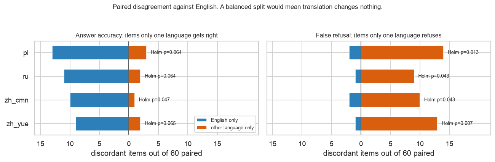
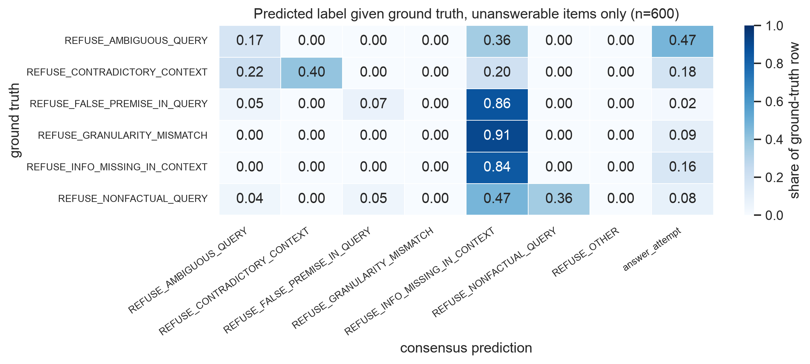
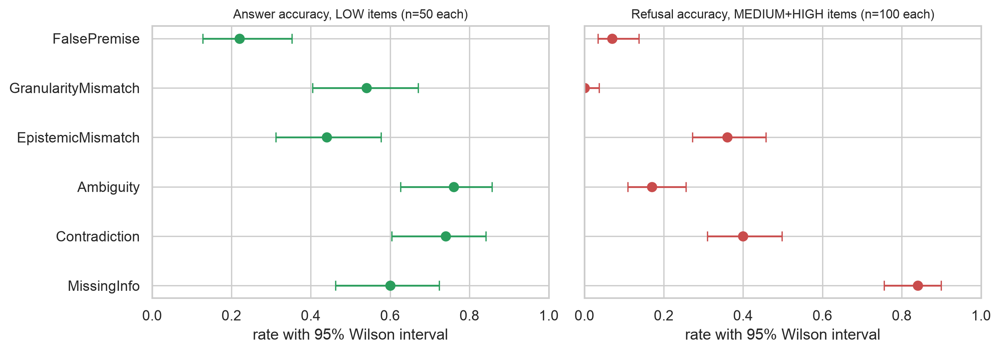
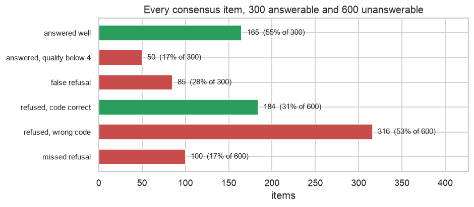
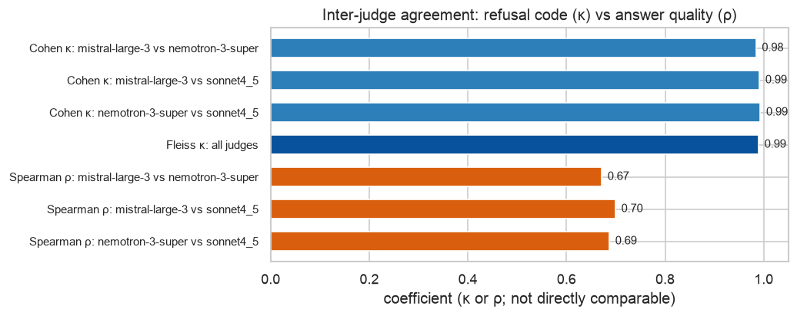
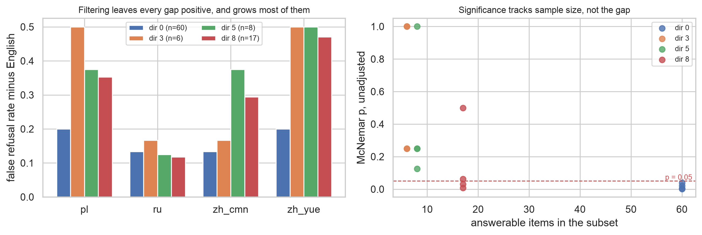
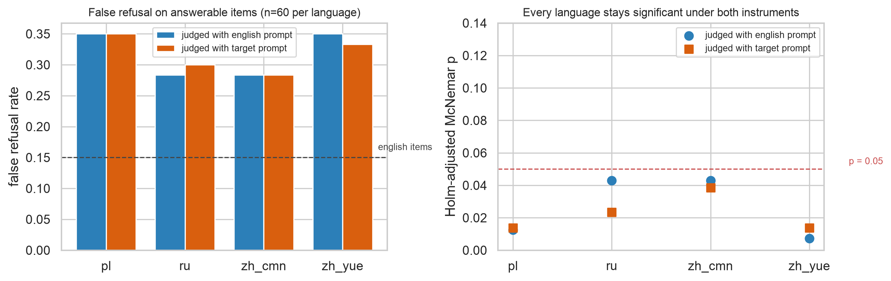

# Pilot v2 findings: does selective refusal survive translation?

This is a summary of what the three analysis notebooks in this directory found. It is meant to be read on its own. Every number here is produced by one of the notebooks, and each section says which one, so anyone who wants the reasoning, the code or the caveats can go straight to the source.

**Everything below is about one model, Llama 3.1 70B.** Section 3.5 says which findings are likely to generalise and which are not.

---

## 1. What was tested

**The capability.** A model given a question plus a supporting context should answer when the context supports an answer, and refuse when it does not. Refusing well means two separate things: noticing that something is wrong (*detection*) and naming what is wrong (*categorisation*). RefusalBench defines seven refusal codes for the second part, such as `REFUSE_INFO_MISSING_IN_CONTEXT` or `REFUSE_FALSE_PREMISE_IN_QUERY`.

**The data.** 180 base items, each translated into five languages (English, Polish, Russian, Mandarin, Cantonese), giving 900 evaluated items. Every item belongs to one of six perturbation classes and one of three intensity levels.

- **LOW** items are unperturbed and **answerable**. All 300 of them.
- **MEDIUM** and **HIGH** items are perturbed and **unanswerable**. All 600 of them.
- Each perturbation class maps to exactly one correct refusal code, one to one.

**The model under test.** Llama 3.1 70B, recorded as `llama3.1:70b` in the `response_metadata` field of every inference record. It is the same model across all four inference run directories and all five languages, which [`pilot_v2_leakage_subsets.ipynb`](pilot_v2_leakage_subsets.ipynb) checks rather than assumes. Nothing in this pilot evaluates any other model.

**The scoring.** Three LLM judges (`mistral-large-3`, `nemotron-3-super`, `sonnet4_5`) read each response and record whether the model answered or refused, which refusal code it used, and an answer quality score from 1 to 5. The reported metrics use the majority verdict across the three. The judges are a separate concern from the model under test, and section 4.2 checks that they are not the source of the main result.

**The key design feature.** The same 180 items appear in every language. They were translated, not resampled. That makes cross-language comparison *paired*, which turns out to be what makes the main result reachable at all.

---

## 2. The headline results

### 2.1 Translation makes the model refuse questions it would have answered

**This is the strongest result in the pilot.**

On answerable questions, the model wrongly refuses **15 percent** of the time in English. Translate the identical question and that rises to between **28 and 35 percent**.

Because the items are paired, this can be counted directly rather than inferred. Out of the 60 answerable items in each language:

| language | refused only after translation | refused only in English |
|---|---|---|
| Polish | 14 | 2 |
| Cantonese | 13 | 1 |
| Mandarin | 10 | 2 |
| Russian | 9 | 1 |

Every language leans the same way and all four survive correction for testing four languages at once (adjusted p from 0.007 to 0.043).



*Bars to the left are items only English gets wrong. Bars to the right are items only the other language gets wrong. A balanced bar would mean translation changed nothing.*

Two things make this result unusually solid for a pilot of this size:

- **It does not depend on which judge you trust.** Rerunning the test under each judge alone, with no majority pooling, reproduces it in all twelve judge-by-language combinations, worst p 0.039.
- **It does not depend on the quality score,** which is the one thing the judges genuinely disagree about (see 2.5). Whether a response is a refusal is a pure classification call, and the judges agree on those at kappa 0.99.

**Answer accuracy moves the same way but the evidence is thinner.** It falls from 0.667 in English to between 0.500 and 0.550 elsewhere. Three of the four languages are individually significant and Cantonese is not, and after correction only Mandarin remains. We report the direction, not the size.

*Source: [`pilot_v2_eval_exploration.ipynb`](pilot_v2_eval_exploration.ipynb) section 5.*

### 2.2 The model collapses its refusal vocabulary onto one code

The model is good at noticing that something is wrong and poor at saying what. On the 600 unanswerable items it declines on **500** but names the correct reason on only **184**.

The reason is a near-total collapse onto one label. `REFUSE_INFO_MISSING_IN_CONTEXT` accounts for **61 percent** of all predictions on unanswerable items, against a true prevalence of 17 percent.



*Each row is the true reason, each column is what the model said, rows sum to 1. A model that told the reasons apart would show a strong diagonal. This shows a vertical stripe.*

- `REFUSE_GRANULARITY_MISMATCH` is **never emitted once in 900 items**, and it is the correct answer for 100 of them. Those items score zero by construction.
- False-premise items are called "information missing" 86 percent of the time. Granularity items, 91 percent.
- A model that refused everything with the single label "information missing" would score 0.167. The observed score is 0.307. Better than a one-word vocabulary, but not by the margin a seven-way task should give.

**Why this matters beyond the finding itself.** `refusal_accuracy` requires an exact seven-way code match, so under this collapse it is not really measuring refusal skill. It mostly measures how close a slice's correct codes sit to the one code the model actually uses. Every downstream `refusal_accuracy` number inherits that, which is why section 3.2 below rejects one of the apparent findings entirely.

*Source: [`pilot_v2_eval_exploration.ipynb`](pilot_v2_eval_exploration.ipynb) section 4.*

### 2.3 False-premise framing causes heavy over-refusal

Splitting the answerable items by perturbation class, one class behaves completely differently from the rest.



Answerable items in the **FalsePremise** class score **0.220** answer accuracy against **0.740 to 0.760** for Contradiction and Ambiguity, driven by a false refusal rate of **0.660**. The false-premise framing makes the model refuse clean, answerable questions two thirds of the time.

Like 2.1, this is measured on the answerable side, so it is untouched by the label collapse. It is a genuine over-refusal finding.

*Source: [`pilot_v2_eval_exploration.ipynb`](pilot_v2_eval_exploration.ipynb) section 6.*

### 2.4 Where all 900 items land



- **Answerable (300).** 165 answered well, 50 answered but below the quality bar, 85 refused outright. The model gives up on 28 percent of questions it should answer.
- **Unanswerable (600).** 184 refused with the right code, 316 refused with the wrong code, 100 answered anyway.

Wrong-code refusals are the single largest bucket in the whole pilot.

*Source: [`pilot_v2_eval_exploration.ipynb`](pilot_v2_eval_exploration.ipynb) section 3.*

### 2.5 The judges are reliable for classification and unreliable for quality



- **Refusal code classification is effectively solved.** Cohen kappa 0.984 to 0.993, Fleiss kappa 0.990, raw agreement above 99 percent.
- **Answer quality is not.** Spearman rho 0.67 to 0.70, with judges differing by about a third of a point on the 1 to 5 scale.

That split has a practical consequence. `answer_accuracy` is gated on quality reaching 4, so it carries the noise. Simply choosing which of the three judges to trust moves the calibrated score by up to **0.058**, which is comparable to the largest gap between languages. Any language claim resting on `answer_accuracy` has to clear that bar, and 2.1 is trustworthy precisely because it does not rest on it.

**On the ensemble question:** a single judge would give practically the same refusal codes. The three-judge ensemble earns its cost only on the quality gate.

*Source: [`pilot_v2_eval_exploration.ipynb`](pilot_v2_eval_exploration.ipynb) section 2.*

---

## 3. What the pilot does not show

Three things look like findings and are not. Each one is worth knowing about, because each is easy to report by mistake.

### 3.1 A ranking between the four languages

The paired test establishes the direction and that it is real. It does not pin the size. The gaps between languages in calibrated score run 0.050 to 0.100, and judge choice alone moves the same number by 0.058. We can say "translation degrades selective refusal, driven by over-refusal".

### 3.2 A difficulty ranking across perturbation classes on the refusal side

The right-hand panel of the perturbation figure looks decisive: MissingInfo scores 0.84 and Granularity scores 0.00, with intervals nowhere near overlapping. It is an artefact. MissingInfo scores well because its correct code happens to be the one code the model defaults to, and Granularity scores zero because its code is never emitted at all.

**That panel is a map of the model's label vocabulary, not of task difficulty.** The honest statement is that the model has no granularity refusal behaviour whatsoever.

### 3.3 Anything about intensity

Answerability is perfectly confounded with intensity in this design. LOW carries every answerable item and MEDIUM and HIGH carry every unanswerable one, so LOW is scored on a different metric and a different population from the other two. The three numbers are not on a common scale and must not be ranked.

The one legitimate comparison is MEDIUM against HIGH, both entirely unanswerable and carrying identical distributions of correct codes. There, HIGH is detected more readily: 261 declines against 239, and 105 right codes against 79, out of 300 each. That is what the perturbation design intends, since HIGH items carry more severe defects, so it confirms the design works rather than revealing anything about the model.

**One genuinely interesting thing does come out of it.** `REFUSE_INFO_MISSING_IN_CONTEXT` is emitted **exactly 182 times at each intensity level**. Making the defect more obvious changes whether the model refuses and does not shift the code it reaches for. Detection and categorisation really are separate skills here.

### 3.4 Anything at the finest slice

`metrics_by_stratum.csv` has 90 rows of 10 items each. At n=10 a 95 percent interval is about half the scale wide, and all 90 rows are pure, so none of them carries a calibrated score at all. Use that file to check design balance and for nothing else.

### 3.5 Anything about models other than Llama 3.1 70B

Only one model was evaluated, so nothing here is a claim about language models in general. The RefusalBench paper, included locally as [`refusalbench.md`](refusalbench.md), does evaluate 30 or more models and gives a rough sense of which of our findings are model-specific.

- **The refusal-code collapse is a known general pattern, and it is worse here.** The paper reports that models default to `REFUSE_INFO_MISSING` as a catch-all, taking 25 percent of all predictions on RefusalBench-NQ, with granularity and ambiguity items the ones most often misfiled as missing information. Our model shows the same failure at **61 percent**, and never emits the granularity code at all. So the shape is general and the severity is not.
- **The cross-language result has no cross-model comparison at all.** The paper's benchmarks are English-only by its own account, so the translation findings in 2.1 are new ground with a sample size of one model. They should be treated as a result about this model until a second one is run.

---

## 4. Two artefact explanations were tested, and neither survives

The result in 2.1 attracted two obvious objections. Both were checked in their own notebook.

### 4.1 "The translations still contain English, so you are measuring the mess"

If a supposedly Polish prompt still carries chunks of untranslated English, the model is being scored on a code-switched input rather than on Polish.

Three progressively stricter filtered subsets already existed, keeping 18, 30 and 55 of the 180 items. Restricting to them makes the gap **larger**, not smaller, in every subset and in every language. In the cleanest subset the disagreements become entirely one-sided, with **zero** cases of English refusing where a translation does not.



Two important qualifications:

- **The subsets on their own cannot settle it.** They leave 6, 8 and 17 answerable items. The smallest cannot reach significance at any effect size, and one perturbation class disappears from it entirely, so any raw full-versus-filtered comparison would be measuring composition rather than leakage.
- **Measured properly, the direction holds but the size does not.** Scoring leakage on all 180 items and splitting them five different ways, cleaner items show the larger gap under four of the five, monotonically across tertiles on both leakage measures. But the p value ranges from 0.03 to 0.90 depending on how "clean" is defined. Treat this as leakage failing to explain the effect and probably diluting it, not as a measured dilution of a given size.

*Source: [`pilot_v2_leakage_subsets.ipynb`](pilot_v2_leakage_subsets.ipynb).*

### 4.2 "The judge was instructed in English, so it is harsher on other languages"

Every verdict came from a judge reading English instructions, whatever the language of the response. A judge that was harsher on unfamiliar text would produce exactly the observed pattern.

The whole evaluation was rerun with each judge instructed in the language it was reading. This design has a built-in placebo: for English, the "localised" prompt *is* the canonical prompt, so anything that moves in the English slice is judge non-determinism and nothing else.



- Consensus classification labels are identical on **896 of 900 items**.
- No consensus metric on any language moves by more than **0.017**, against the 0.058 that swapping judges moves.
- The false refusal rates change by at most **one item in 60**, and all four languages still clear correction.
- **No language moves towards the English baseline,** which is what a language-biased judge would have produced.
- The refusal-code collapse from 2.2 is unchanged, so it is a property of the model and not of English-instructed judging.

Localising the judge prompt also buys nothing. Inter-judge classification kappa moves by at most 0.005, and quality agreement moves up for two judge pairs and down for the third, which is noise rather than improvement.

*Source: [`pilot_v2_judge_prompt_language.ipynb`](pilot_v2_judge_prompt_language.ipynb).*

---

## 5. What to change before scaling up (by Claude)

**On the design**

1. **Keep the paired design and analyse it as paired.** Translating the same items rather than sampling fresh ones per language is what makes 2.1 reachable at 60 items. An unpaired reading of the same data finds nothing at all. Any scaled-up run should preserve the shared item set, and the metrics files should carry the item ID so paired tests remain possible downstream.
2. **Break the answerability and intensity confound.** Put answerable controls at every intensity, or stop calling the answerable stratum an intensity level. As built, no intensity conclusion is reachable.
3. **Spend extra items on answer quality rather than on more languages.** False refusal already resolves at 60 items per language. Answer accuracy does not, because it is gated on the one judgment the judges disagree about.

**On the metrics**

4. **Add a partial-credit refusal metric.** Exact seven-way code matching scores a correctly detected refusal as a total failure whenever the code is wrong, which is 316 of 500 detections here. A detection metric plus a separate conditional typing metric would untangle the two skills, which section 3.3 shows move independently.
5. **Report `answer_accuracy` and `refusal_accuracy` separately and retire the pooled calibrated score,** or at least never publish it without both components. Averaging a judge-noise-dominated metric with a label-collapse-dominated metric gives a number whose movements cannot be attributed to anything.

**On the pipeline**

6. **Keep `english` as the default judge prompt.** It is cheaper, it needs no translated judge segments kept in sync with the rubric, and the localised run shows it costs nothing. Keep `--judge-prompt-language target` as a robustness check for when the rubric or the language set changes.
7. **Do not use the three filtered subset directories as an evaluation filter.** Score leakage over all items and use it as a covariate instead. That keeps the design balanced and keeps the sample at 60 rather than 6.
8. **Get the translations reviewed by a speaker of each language.** This is the one check none of the three notebooks can perform, and it is now the main outstanding risk to the headline result.

---

## 6. Where to look for more

| Question | Notebook |
|---|---|
| How were the metrics defined, and what does the design allow? | [`pilot_v2_eval_exploration.ipynb`](pilot_v2_eval_exploration.ipynb) sections 1 and 2 |
| The full picture of all 900 items, and the label collapse | sections 3 and 4 |
| The language result, paired and unpaired, and why paired is right | section 5 |
| Perturbation classes and intensity | sections 6 and 7 |
| Does English left in the prompts explain the result? | [`pilot_v2_leakage_subsets.ipynb`](pilot_v2_leakage_subsets.ipynb) |
| Does the judge's own prompt language explain it? | [`pilot_v2_judge_prompt_language.ipynb`](pilot_v2_judge_prompt_language.ipynb) |
| How to regenerate the data and run the notebooks | [`README.md`](README.md) |

Figures in this report are exported directly from the executed notebooks by [`export_figures.py`](export_figures.py), so they always match the analysis they came from. Re-run it after re-executing any notebook:

```bash
uv run python notebooks/export_figures.py
```
